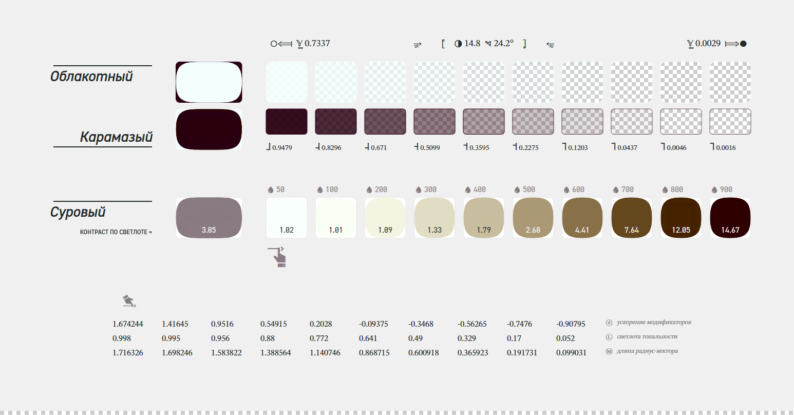

# ПО "Цветная Люстра". Реализация [цифровой палитры цвета](https://bpanchenko.github.io/chromatic-chandelier/)

ПО "Цветная Люстра" предоставляет инструменты расширения возможностей цветовой схемы цифрового продукта.\
Экземпляр палитры генерирует дополнительные оттенки для выбраных базовых цветов. Дополнительные цвета генерируются на основе алгоритма управляемого параметрами конфигурации. Реализация актуальных стандартов [CSS](https://www.w3.org/TR/css-color-4/) в совокупности с тремя этапами автоматизированого тестирования программного кода позволяет составлять гармоничное цветовое решение. Зрительное восприятие цвета сохраняется с учетом доступного спектра при визуализации.

### Тестирование исходного кода

ПО "Цветная Люстра" разрабатывается через автоматизированное тестирование в три этапа: тестирование спецификаций, модульное тестирование известных образцов цвета и сквозное тестирование (E2E) с интеграцией ПО.\
Смотри [отчёт о покрытии кода тестами](https://bpanchenko.github.io/chromatic-chandelier/test-report/coverage) и [результаты прогона автотестов](https://bpanchenko.github.io/chromatic-chandelier/test-report/results.spec-testing.html).



> Визуализация палитры протосайта: https://bpanchenko.github.io/chromatic-chandelier/assets/pictures/svg/widget.protosite-palette.svg . Результат работы ПО - это таблица сгенерированных оттенков, для проверки алгоритмов применяется рендеринг векторного изображения в формате SVG.

## В NPM-пакете опубликован программный справочник цветовых пространст вместе с набором необходимых для работы с цветом классов и утилит.

[](https://www.npmjs.com/package/chromatic-chandelier)

```bash
npm install chromatic-chandelier -D
```

## Справочник цветовых пространств

Модуль `chromatic-chandelier/manual` предоставляет коллекцию объектов определения цветовых пространств и функций преобразования цветового пространства. Модуль составлен в виде справочного руководства по цветовым пространствам. Программные компоненты содержат справочные материалы и используются в работе ПО "Цветная Люстра".

### Проекция цвета в другое пространство

Изменение пространства определения цвета осуществляется путём определения новой точки в целевом пространстве по вычисленным координатам проекции цветовых компонент исходного пространства. В справочнике реализованы преобразования цветовых пространств из спецификации [CSS Color 4](https://www.w3.org/TR/css-color-4/#color-conversion-code), дан обновлённый стандарт вычислительных алгоритмов.

Датасеты публичных образцов цвета, для которых были применены преобразования из модуля `chromatic-chandelier/manual`:

1. https://bpanchenko.github.io/chromatic-chandelier/atlas.ral-classic.json
1. https://bpanchenko.github.io/chromatic-chandelier/atlas.ral-library.json
1. https://bpanchenko.github.io/chromatic-chandelier/atlas.wada-sanzo.json
1. https://bpanchenko.github.io/chromatic-chandelier/atlas.werner.json
1. https://bpanchenko.github.io/chromatic-chandelier/atlas.yandex-wizard.json

Атласы образцов:

1. [Die Farbtöne aller drei RAL Farbpaletten](https://bpanchenko.github.io/chromatic-chandelier/samples-compilation/all-ral-colours.html)
1. [RAL Classic Farbsammlung](https://bpanchenko.github.io/chromatic-chandelier/samples-compilation/ral-classic.html)
1. [«Словарь цветовых комбинаций» Сандзо Вада (Sаnzо Wadа)](https://bpanchenko.github.io/chromatic-chandelier/samples-compilation/wada-sanzo-dictionary.html)
1. [Werner’s Nomenclature of Colours](https://bpanchenko.github.io/chromatic-chandelier/samples-compilation/werner-guidebook.html)
1. [Справочник колдунщика цветов от поисковой системы Яндекс](https://bpanchenko.github.io/chromatic-chandelier/samples-compilation/yandex-color-wizard.html)
